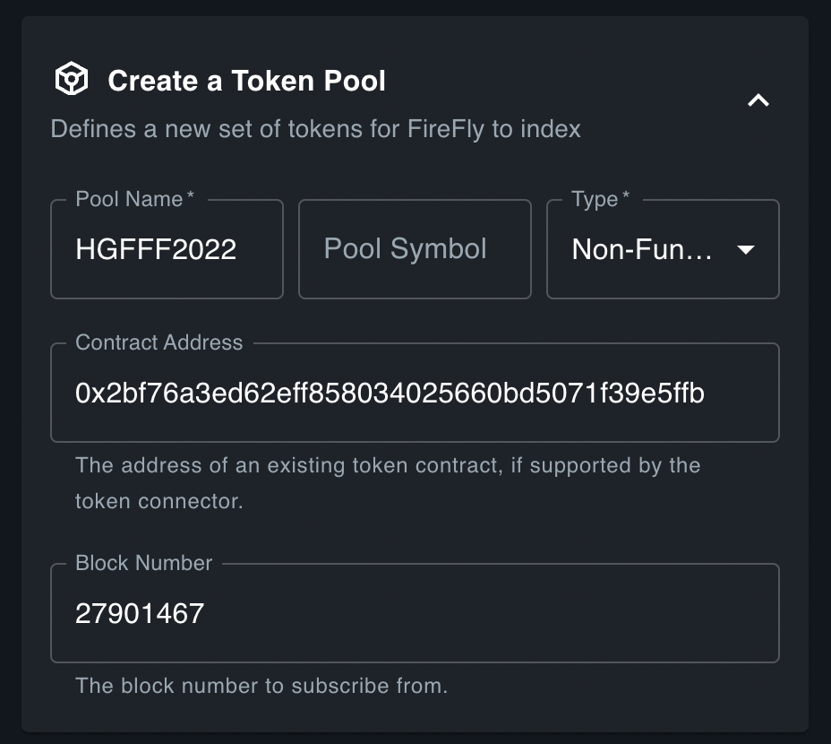
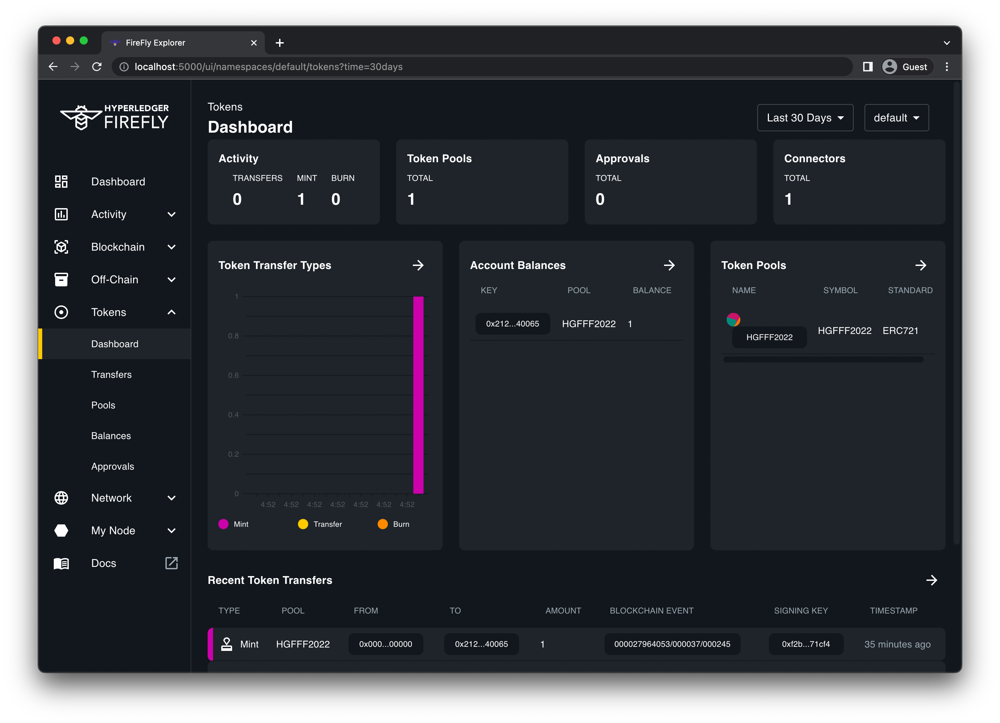
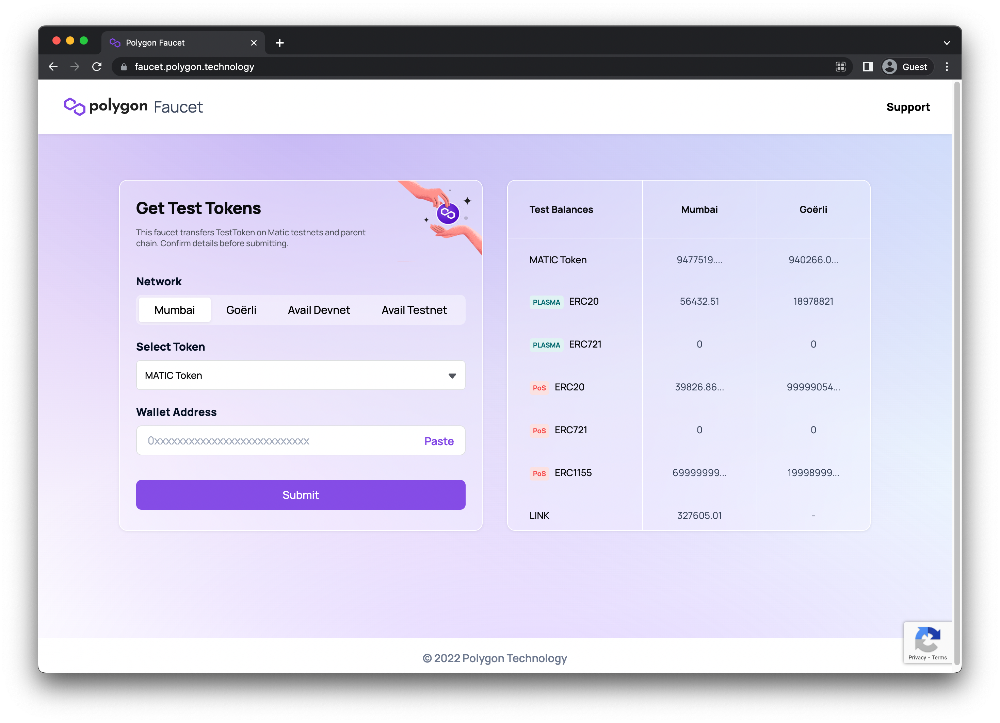

# Hyperledger FireFly Workshop: Part I

_Hyperledger Global Forum 2022_

Welcome to the FireFly Workshop at Hyperledger Global Forum 2022.
We're glad you're here!

In Part I of this workshop we will be setting up FireFly v1.1, walking through using FireFly as a Web3 Gateway on a public testnet, minting an NFT.

In Part II, we will walk through deploying your own NFT smart contract, and using FireFly to interact with it.

## Set up an Ethereum wallet on Polygon Mumbai Testnet

To "see" your NFT and to be able to transfer it in the future, you will need an Ethereum wallet app. This can be an app on your smartphone, or on your computer. You're welcome to use any wallet app you like, as long as it can connect to the Polygon Mumbai Testnet.

> **NOTE**: Some wallet apps do not display images in ERC-721 tokens. For example, the Metamask browser extension will not display the image, but the Metamask mobile app will.

You can use an existing private key that you may have already (typically by entering your 12 word seed phrase in to the wallet), or you can create a new private key / address for this workshop.

If you don't have a wallet app already, an open source option that I have tested and verified displays the NFT correctly is [Alpha Wallet](https://alphawallet.com/). It is compatible with both iOS and Android.

## Install FireFly CLI

To set up our local development environment, we will use the FireFly CLI. For detailed instructions please see the docs page on how to [Install the FireFly CLI](https://hyperledger.github.io/firefly/gettingstarted/firefly_cli.html).

## Create a FireFly Stack

After you have the FireFly CLI installed, you can create the environment for this workshop. Run the following command in a terminal:

### Create a blockchain connector config file

For this particular chain, we need to tweak a couple of settings in the blockchain connector. To do this, we can pass a custom config file to the FireFly CLI, and it will be merged with the existing config file.

Here our custom config file will:

1. Require a transaction to be present in 4 consecutive blocks (confirmations) to consider it final
1. Use a dynamic gas price - the price of gas fluctuates on most public chains as the network becomes more or less busy
1. Use the blockchain connector to query the price of gas before submitting the transaction

Run the following command to crete a config file in your home directory:

```
echo 'connector:
confirmations:
    required: 4
policyengine.simple:
    fixedGasPrice: null
    gasOracle:
        mode: connector' \
    > ~/evmconnect.yml
```

### Create a FireFly stack

Now we can create a FireFly stack. Here is what the following flags do:

1. Creates a FireFly Stack named `workshop` with one member.
1. Does not enable multiparty mode - just creates a Web3 Gateway
1. Connect to public IPFS nodes
1. Sets the blockchain type to Ethereum
1. Sets the blockchain connector to `evmconnect` - a new blockchain connector that implements the FireFly Connector API with public chain capabilities
1. Tell the FireFly CLI that we would like to use a remote blockchain node
1. Set the URL to the remote blockchain node
1. Set the chain ID to the ID of the Polygon Mumbai testnet
1. Pass in our custom config file we created in the previous step

```
ff init workshop 1 \
    --multiparty=false \
    --ipfs-mode remote \
    --blockchain-provider ethereum \
    --blockchain-connector evmconnect \
    --blockchain-node remote-rpc \
    --remote-node-url http://ec2-18-117-125-203.us-east-2.compute.amazonaws.com:8545 \
    --chain-id 80001 \
    --connector-config ~/evmconnect.yml
```

## Lookup information about the contract

The address for the contract we will be using is **`0x2bf76a3ed62eff858034025660bd5071f39e5ffb`**.

This contract was deployed at block **`27901467`**.

You can verify the details of this contract on Polygonscan:
[https://mumbai.polygonscan.com/address/0x2bf76a3ed62eff858034025660bd5071f39e5ffb](https://mumbai.polygonscan.com/address/0x2bf76a3ed62eff858034025660bd5071f39e5ffb)

You can also lookup the block number in which the contract was deployed by clicking the link to the transaction hash on the right side of the page under **More Info**.

## Create a Token Pool

To index our token and track mint / transfer events we are going to create a Token Pool in FireFly.

Navigate to the FireFly Sandbox at: [http://127.0.0.1:5109](http://127.0.0.1:5109). On the Tokens tab fill in the following details to **Create a Token Pool**:

| Field                | Value                                        |
| -------------------- | -------------------------------------------- |
| **Pool Name**        | `HGFFF2022`                                  |
| **Pool Symbol**      | (leave blank)                                |
| **Type**             | Non-fungible                                 |
| **Contract address** | `0x2bf76a3ed62eff858034025660bd5071f39e5ffb` |
| **Block number**     | `27901467`                                   |



When you click **Send** FireFly will begin indexing that token at the specified Block Number.

> **NOTE**: Depending on how far back the specified block number was, it may take some time to index all the events from that point forward until now.

You can now check the [Tokens Dashboard in the FireFly Explorer](http://localhost:5000/ui/namespaces/default/tokens?time=30days) to see all of the transactions for this contract (that have been indexed so far).



## Get some MATIC to pay for gas

Before we can mint our NFT we need some funds to pay for gas. On Polygon chains, the currency used to pay for gas is **MATIC**. We need to transfer some funds to the account address that your FireFly Supernode is using. To lookup that account address, we can use the FireFly CLI. Run:

```
ff accounts list workshop
```

```
[
  {
    "address": "0xf2bdf61e052141d80d066c88f4ce0c9908771cf4",
    "privateKey": "xxx"
  }
]
```

Copy the `address` value listed there.

You should be able to get a small amount of MATIC on the Mumbai testnet from the [Polygon Faucet](https://faucet.polygon.technology/) for free. Just paste the account address into the form and click **Submit**.



You should then be able to confirm your account balance on [Polygonscan Mumbai](https://mumbai.polygonscan.com/). Paste your account address there, and check the **Balance** field, or look under **Internal Txns** to see the transaction that transferred MATIC to your account. 

> **NOTE**: It may take several minutes for your balance to be reflected on Polygonscan as it waits for several confirmation blocks to be mined.

## Mint an NFT to your wallet

Now we're going to use FireFly to mint our NFT. Because we've created a Token Pool, we have access to many functions in the contract already through FireFly's built in Tokens APIs. However, if a certain token contract has custom functions on it, we can use FireFly's Custom Contracts APIs to call any function we want. In this case, our contract has a custom mint function called `safeMint` which only takes a single argument: the `address` of the recipient.

To call our `safeMint` function, we will:

1. Create a Contract Interface by uploading the token contract's Ethereum ABI to FireFly
1. Create a Contract API complete with a Swagger UI for calling functions on a smart contract deployed at a specific location
1. Use the generated Swagger UI to call the `safeMint` function

The next two sections will walk you through the steps to do this.

### Create a Contract Interface

1. First, navigate to the [FireFly Sandbox](http://127.0.0.1:5109/home?action=contracts.interface) and go to the **Contracts** tab. Expand the **Define a Contract Interface** section.
1. Select **ABI - Solidity Application Binary Interface** from the Interface Format drop down.
1. Give it a name, such as **`HGFFF2022`**
1. Give it a version such as **`1.0`**
1. Copy the `"abi"` section from the [combined JSON file for the contract in this repo](../artifacts/contracts/FireFlyWorkshopBadge.sol/FireFlyWorkshopBadge.json). Copy the whole JSON array. Paste this into the **Schema** field in the Sandbox.
1. Click **Run**

### Register a Contract API

1. Still on the same page in the Sandbox, expand the `Register a Contract API` section.
1. Ensure the **`HGFFF20222`** Contract Interface created in the step above is selected
1. Give it a URL-safe name such as **`HGFFF20222`**
1. Paste the contract address: **`0x2bf76a3ed62eff858034025660bd5071f39e5ffb`**
1. Click **Run**

### Mint your NFT

1. At the top of the Sandbox page there should be a new item in the **APIs Known to FireFly** section. Click the popout icon to see the Swagger UI.
2. Scroll down to the `POST` `/invoke/safeMint` endpoint, expand that section and click **Try it out**.
3. Paste your Ethereum address from the wallet that you set up at the beginning of the workshop in the `"to"` field:
```
{
  "input": {
    "to": "0x212c8fccB357da5CdB36903056C22c6B48540065"
  },
  "options": {}
}
```
4. Click **Execute**

FireFly returns a payload which represents the **Operation** of invoking a smart contract function.

```json
{
  "id": "37151567-5781-4105-8c4d-78de9d120cbf",
  "namespace": "default",
  "tx": "a2e2e4f4-1cd8-418c-9823-8dc396ce7bae",
  "type": "blockchain_invoke",
  "status": "Pending",
  "plugin": "ethereum",
  "input": {
    "input": {
      "to": "0x212c8fccB357da5CdB36903056C22c6B48540065"
    },
    "interface": "8832a7ef-7249-407c-b574-a7eb9ad1bbc8",
    "key": "0x212c8fccb357da5cdb36903056c22c6b48540065",
    "location": {
      "address": "0x2bf76a3ed62eff858034025660bd5071f39e5ffb"
    },
    "method": {
      "description": "",
      "details": {
        "stateMutability": "nonpayable"
      },
      "id": "7be13d75-132e-4f5d-92e0-8e4760a892a1",
      "interface": "8832a7ef-7249-407c-b574-a7eb9ad1bbc8",
      "name": "safeMint",
      "namespace": "default",
      "params": [
        {
          "name": "to",
          "schema": {
            "description": "A hex encoded set of bytes, with an optional '0x' prefix",
            "details": {
              "internalType": "address",
              "type": "address"
            },
            "type": "string"
          }
        }
      ],
      "pathname": "safeMint",
      "returns": []
    },
    "methodPath": "safeMint",
    "options": {},
    "type": "invoke"
  },
  "created": "2022-09-07T01:56:17.130218801Z",
  "updated": "2022-09-07T01:56:17.130218801Z"
}
```

You can take the `"id"` field of this Operation, and make a `GET` request to the [`/operations/{opid}`](http://localhost:5000/api#/Default%20Namespace/getOpByID) endpoint to check on the status of your blockchain transaction.

> **NOTE**: In a production application, this is an ideal use case for FireFly's WebSocket Subscription feature. Instead of polling the `/operations` endpoint, an app can simply listen for a message on a WebSocket to know when the transaction is complete. 

Our blockchain connector was configured to require 4 confirmations, so it will wait for 4 consecutive blocks to be mined which all have our `safeMint` transaction in them, before declaring that the transaction has succeeded.

After a minute or two, the Operation should have **`Succeeded`**. You should also see the NFT show up in your wallet app.

> **NOTE**: Depending on your wallet app, you may need to explicitly add the contract address used in this workshop for it to discover the new token.

## Congratulations!

Congratulations! You've minted an NFT using FireFly on a public blockchain! This NFT is yours to keep as a souvenir for participating in this workshop. It is exclusive to this workshop at Hyperledger Global Forum 2022, and nobody will be able to mint more of them after the workshop is over, so enjoy your bragging rights!